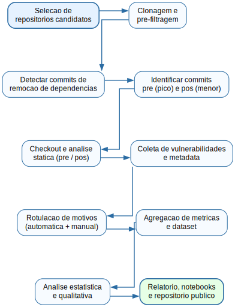

# Trabalho Final de Medição
Disciplina: Engenharia de Software  
Projeto / TCC: Por que Desenvolvedores Deixam de Usar Bibliotecas de Terceiros: Evidências a partir de Projetos JavaScript  
ID / código: EXP-DP-01

Versão: v1.0 (2025-12-05)  
Histórico: v1.0: Documento inicial adaptado ao tema "remoção de dependências em projetos JavaScript".

---

## 1. Identificação básica

### 1.1 Título do experimento / TCC
Por que Desenvolvedores Deixam de Usar Bibliotecas de Terceiros: Evidências a partir de Projetos JavaScript

### 1.2 Versão do documento e histórico de revisão
Versão: v1.0 (2025-12-05)  
Histórico: Documento inicial.

### 1.3 Datas (criação, última atualização)
Criação: 2025-12-05  
Última atualização: 2025-12-05

### 1.4 Autores (nome, área, contato)
Autor principal: Victor Reis Carlota – Engenharia de Software  
Contribuidores: André H. Hyodo, Gustavo P. Pereira, Luís Felipe T. D. Brescia, Luiz Felipe C. de Morais, Marcus V. Carvalho (lista de autores do estudo de referência).

### 1.5 Responsável principal (PI / dono do experimento)
Responsável (PI): Victor Reis Carlota

### 1.6 Projeto / produto / iniciativa relacionada
Trabalho de Conclusão de Curso (TCC) em Engenharia de Software — estudo empírico por mineração de repositórios GitHub / npm para entender motivações, impactos e consequências da remoção de dependências em projetos JavaScript/Node.js.

---

## 2. Contexto e problema

Bibliotecas de terceiros são centrais no ecossistema JavaScript (npm). Apesar das vantagens, desenvolvedores muitas vezes removem ou substituem dependências. Compreender os motivos, a frequência e os efeitos dessas remoções (segurança, complexidade, tamanho do código, adoção de APIs nativas) é relevante para orientar práticas de manutenção, políticas de dependências e decisões arquiteturais. Este estudo investiga empiricamente ocorrências de remoção de dependências em repositórios JavaScript hospedados no GitHub, buscando identificar motivações (segurança, desempenho, custo de manutenção, obsolescência), e quantificar impactos em métricas de código e segurança.

---

## 3. Objetivos e questões (Goal / Question / Metric - GQM)

Objetivo Geral: Analisar, por meio de mineração de repositórios e análise quantitativa/qualitativa, as motivações e impactos associados à remoção de bibliotecas externas em projetos JavaScript.

Variável dependente única (VD):  
- M1 — Redução do Número de Dependências (DeltaDeps): diferença entre o número de dependências no estado pré-refatoração (pico) e no estado pós-refatoração (menor número após reduções). Unidade: contagem.

Observação: M1 é a variável dependente principal das análises inferenciais. As demais medidas (vulnerabilidades, KLOC, complexidade etc.) são métricas de apoio/atributos.

### 3.1 Objetivos específicos
- O1: Identificar commits que representam remoção ou substituição de dependências em repositórios JavaScript.
- O2: Categorizar motivos das remoções a partir de mensagens de commit, issues/PR e diffs (segurança, performance, manutenção, substituição por nativo, obsolescência, etc.).
- O3: Quantificar o impacto da remoção sobre vulnerabilidades conhecidas (CVE), tamanho (KLOC) e complexidade (cyclomatic).
- O4: Investigiar se a remoção leva à substituição por funções nativas do JavaScript ou remoção simples de referência.
- O5: Fornecer recomendações práticas para gerenciamento de dependências.

### 3.2 GQM (exemplos de perguntas e métricas)
- Q1: A redução de dependências (M1) está associada a diminuição do número de vulnerabilidades (M_vuln)?  
  - Métricas: M1 (VD), M_vuln (nº de CVEs), M9 (RMSE não aplicável aqui — substituir por contagem de CVEs).
- Q2: A redução de dependências impacta o KLOC e a complexidade (M2/M3)?  
  - Métricas: M2 (ΔKLOC), M3 (ΔCyclomatic).
- Q3: Em que proporção a remoção foi substituída por implementações nativas do JS (M4)?  
  - Métricas: M4 (Proporção de substituições por nativo), M1 (VD).
- Q4: Quais categorias motivacionais são mais frequentes (M5 categórica)?  
  - Métricas: M5 (categoria de motivo por commit/PR), contagens por categoria.

---

## 4. Métricas (descrição e unidade)

| Métrica (código) | Descrição | Unidade |
|---|---|---|
| M1 – DeltaDeps (VD) | Redução no número de dependências (pré - pós) | contagem |
| M_vuln | Número de vulnerabilidades associadas às dependências (por severidade: alta/média/baixa) | contagem |
| M2 – ΔKLOC | Variação do número de linhas de código (KLOC) antes x depois | linhas |
| M3 – ΔCyclomatic | Variação média da complexidade ciclomática do código | unidade de complexidade |
| M4 – NativeSubstRate | Proporção de remoções que resultaram em substituição por funções nativas | % |
| M5 – MotiveCategory | Categoria do motivo declarado/induzido (Security, Performance, Maintenance, Obsolescence, NativeAvailable, Other) | categórica |
| M6 – CommitMessageConfidence | Confiança na inferência do motivo a partir de msg/PR (alta/média/baixa) | categórica |
| M7 – KLOC_after | KLOC após refatoração | linhas |
| M8 – DependencyAgeAvg | Idade média das dependências removidas (tempo desde primeiro release ou última atualização) | meses/anos |
| M9 – DependencyUsageRate | Fração de dependências listadas que são efetivamente importadas/used no código | % |
| M10 – TimeToRefactor | Tempo decorrido entre primeiro pico e momento de menor número de dependências | dias |
| M11 – RepoActivity | Métrica de atividade do repositório (commits por mês) | commits/mês |

---

## 5. Escopo e contexto do experimento

### 5.1 Incluído
- Mineração de ~1.000 repositórios JavaScript/Node.js (ou número acordado) do GitHub que apresentam histórico de remoção de dependências.
- Identificação automática de commits que removem dependências (análise de package.json e pastas de packages) e seleção de dois estados por repositório: pré-refatoração (maior número de dependências) e pós-refatoração (menor número após reduções).
- Análise estática de código nos dois estados (KLOC, complexidade, import usage).
- Extração de CVEs/vulnerabilidades associadas às dependências (canais públicos como npm audit advisories, OSV).
- Rotulação manual/semiautomática de motivos a partir de commit messages, PRs e issues.
- Análise quantitativa e qualitativa (estatística descritiva, testes, categorização qualitative).

### 5.2 Excluído
- Estudos profundos de segurança dinâmica (exploração de CVEs) ou análise de desempenho runtime dos sistemas além da categorização de motivos.
- Repositórios privados sem autorização.

---

## 6. Stakeholders e impacto esperado

- Estudantes e orientadores do TCC; comunidade acadêmica de Engenharia de Software; mantenedores OSS; equipes que gerenciam cadeias de dependências.  
Impacto esperado: evidências empíricas sobre motivos e efeitos da remoção de dependências, orientações para políticas de gestão de dependências e práticas de manutenção.

---

## 7. Riscos, premissas e critérios de sucesso

### 7.1 Riscos principais
- R1: Dificuldade em inferir motivo correto a partir de mensagens de commit/PR (ruído ou ausência de justificativa).
- R2: Inconsistências na forma como dependências são registradas (monorepos, workspaces) dificultando detecção automática.
- R3: Dados de vulnerabilidades incompletos ou não vinculáveis às versões específicas.
- R4: Amostra não representativa (viés de seleção).

### 7.2 Premissas
- Repositórios públicos suficientemente documentados e com histórico Git coerente.
- Ferramentas externas (npm advisories, OSV) fornecem dados de vulnerabilidades indexáveis.
- Possibilidade de validação manual de uma amostra para calibrar classificadores.

### 7.3 Critérios de sucesso
- Identificação automática correta (precision/recall) de commits-chave acima de limiar mínimo (ex.: precision ≥ 0.8 em sample de validação).
- Conjunto de ~1.000 repositórios com dois estados (pré/pós) válidos para análise.
- Evidência estatística das relações pesquisadas (p.ex. redução média de CVEs associada a DeltaDeps com p < 0.05) ou justificativa alternativa.

---

## 8. Metodologia resumida e cronograma (sugestão para 3 meses)

1. Semana 1–2: Revisão bibliográfica, seleção e filtragem inicial de repositórios; desenvolvimento de scripts de mineração.  
2. Semana 3–4: Implementação dos detectores de commits (remoção de dependências), pipeline de clonagem e extração de estados (pré/pós).  
3. Semana 5–6: Análise estática (KLOC, cyclomatic), coleta de CVEs e métricas de uso de dependências.  
4. Semana 7–8: Rotulação (manual/semiauto) de motivos, treinamento/ajuste de heurísticas de classificação.  
5. Semana 9–10: Execução das análises estatísticas e geração de visualizações; validação de resultados com amostra manual.  
6. Semana 11–12: Redação do relatório, preparação de artefatos reprodutíveis (scripts, notebooks) e gravação do vídeo de ameaças à validade.

---

## 9. Instrumentação e protocolo operacional (resumo)

- Ferramentas e bibliotecas: Git (libgit2/GitPython), Node.js/npm, Python (pandas, numpy, regex), Lizard (ou similar) para complexidade, frameworks de parsing AST (esprima/cherow), npm-audit/OSV API para vulnerabilidades, Jupyter Notebooks, Docker para reprodutibilidade.
- Scripts principais:
  - miner.py: percorre repositórios, identifica commits que alteram package.json ou diretórios de packages, registra eventos;
  - extract_state.py: faz checkout de commits-chave e gera snapshot (codebase) para análise;
  - metrics.py: calcula KLOC, cyclomatic, dependency usage;
  - vuln_lookup.py: consulta advisories/OSV para dependências e versões;
  - labeler.py: heurísticas de categorização de motivo a partir de commit message + PR/issue;
- Protocolos: cada run grava metadata (repo, commit SHA, timestamp, runner env, versions), outputs em JSON/CSV, e hashes dos snapshots.

---

## 10. Plano de análise de dados (resumo)

- Estatística descritiva: contagens, proporções de categorias de motivos, distribuição de DeltaDeps, distribuição de CVEs por severidade antes/pós.
- Comparações pareadas (pré vs pós): Wilcoxon signed-rank test ou paired t-test para ΔKLOC, ΔCyclomatic, e contagens de vulnerabilidades conforme distribuição.
- Modelagem: regressão (por exemplo, Poisson/negative binomial) para relacionar DeltaDeps (M1) a fatores independentes (DependencyAgeAvg, RepoActivity, MotiveCategory).
- Análise qualitativa: amostra manual de commits e PRs para validar categorias e inferências.
- Visualizações: boxplots, violin plots, barras por categoria, séries temporais de dependências.

---

## 11. Documentação e reprodutibilidade

- Repositório público com:
  - scripts de mineração e análise, Dockerfile para ambiente reprodutível, notebooks com análises e plots;
  - dataset (metadados, métricas) disponibilizado conforme licenças dos repositórios originais e políticas de pesquisa;
  - instruções "run_all.sh" e "README" com requisitos.

---

## 12. Contatos e próximos passos

- Responsável: Victor Reis Carlota  
Próximos passos imediatos: definir lista inicial de repositórios (candidatos), implementar detector de commits de remoção de dependências e validar heurísticas em n=50 repositórios.

---

## 13. Tabela de Variáveis e Descrições

| Variável | Símbolo | Descrição | Unidade / Observação |
|---|---:|---|---|
| Redução de dependências (VD) | M1 / DeltaDeps | Número de dependências removidas (pré - pós) | contagem |
| Vulnerabilidades | M_vuln | Nº de CVEs vinculados às dependências (por severidade) | contagem |
| Linhas de código | M2 / KLOC | KLOC antes e depois | linhas |
| Complexidade | M3 / Cyclomatic | Complexidade ciclomática média | unidade |
| Substituição por nativo | M4 / NativeSubstRate | % de remoções com substituição por API nativa | % |
| Motivo identificado | M5 / MotiveCategory | Categoria do motivo inferido | categórica |
| Confiança da rotulagem | M6 / CommitMessageConfidence | Confiança da inferência do motivo | alta/média/baixa |
| Idade média da dependência | M8 / DependencyAgeAvg | Tempo desde última atualização/primeiro release | meses |
| Uso efetivo | M9 / DependencyUsageRate | % de dependências realmente importadas/usuadas | % |
| Tempo de refatoração | M10 / TimeToRefactor | Tempo entre pico e menor número de dependências | dias |
| Atividade do repo | M11 / RepoActivity | Commits por mês | commits/mês |

---

## 14. Fatores, Tratamentos e Combinações de Experimento

Objetivo: identificar quais fatores estão associados a maior DeltaDeps e quais motivam remoções.

Tabela de fatores e níveis (exemplos):

| Fator | Símbolo | Níveis / Tratamentos | Observações |
|---|---:|---|---|
| Motivo inferido | Motive | Security, Performance, Maintenance, Obsolescence, NativeAvailable, Other | categórico — extraído de commit/PR |
| Dependência vulnerável existente | Vuln | Sim, Não | se havia CVE associado antes da remoção |
| Dependency age | Age | Nova (<6m), Maduro (6m–2y), Antiga (>2y) | influencia decisão |
| Dependency usage | UseRate | Alta (>=50% imports), Baixa (<50%), Zerada | impacto no custo de remoção |
| Repo Activity | Activity | Alta (>30 c/m), Média (10–30 c/m), Baixa (<10 c/m) | suporte à manutenção |
| Projeto tipo | Project | Library, App, CLI, Boilerplate | contexto de remoção |
| Monorepo / Workspace | Mono | Sim, Não | estratégia de packaging complica remoção |

Plano experimental:
- Não é fatorial completo. Realizar análises observacionais com regressões e análise de sobrevivência (time-to-event) considerando delta de dependências como evento. Aplicar amostragem estratificada por Activity e Project type.
- Selecionar N ≈ 1.000 repositórios e registrar fatores para modelagem estatística. Repetir análises em subamostras para robustez.

---

## 15. Fluxograma operacional do experimento (passo a passo)



Detalhamento operacional:
1. Seleção: aplicar filtros (JavaScript/Node.js, atividade mínima, não forks vazios).
2. Pré-filtragem: validar package.json, workspace/monorepo handling.
3. Detecção: analisar diffs de package.json e diretórios node_modules/packed dirs; registrar eventos de remoção.
4. Estados: definir commit "A" (removal event) e "B" (menor dependências após pico).
5. Análises: executar scripts de métricas e lookup de vulnerabilidades nas versões afetadas.
6. Rotulação: heurísticas + revisão manual de amostra para calibrar confidences.
7. Agregação e análise.

---

## 16. Protocolos para reprodutibilidade e registro

- Cada execução salva: repo URL, commit SHA, estado (pré/pós), metadata.json (packages list, versions, KLOC, cyclomatic), vulnerability_report.json, label.json (motivo e confidence), ambiente de execução (docker image hash), timestamp.
- Fornecer Dockerfile e imagem com todas as dependências para executar pipeline de mineração e análise.
- Notebooks com células "run-all" que reproduzem gráficos e estatísticas a partir dos CSV/JSON gerados.

---

## 17. Templates e formulários (resumo)

- Template de run (JSON/YAML): { repo, commit_pre, commit_post, packages_pre, packages_post, metrics_pre, metrics_post, labels }  
- Formulário de rotulação manual (Google Forms / CSV) para classificador: campos (repo, commit, message, PR link, motivo sugerido, confidence, observações).  
- Checklist de verificação de integridade dos snapshots (hashes, tamanho).

---

## 18. Critérios finais de aceitação do experimento

- Detector de commits de remoção com precision ≥ 0.8 e recall aceitável em amostra de validação.  
- Dataset de pelo menos N=1.000 repositórios com pré/pós completos e metadados validados.  
- Resultados reproduzíveis via Docker e scripts fornecidos.  
- Relatório com análises estatísticas que respondem RQ1..RQ3 (descritos abaixo) e recomendações práticas.

---

## 19. Perguntas de Pesquisa (RQs) mapeadas ao estudo

RQ1. A remoção de bibliotecas externas reduz a superfície de ataque e a exposição a vulnerabilidades conhecidas no ecossistema do projeto?  
- Métricas: M_vuln (contagem por severidade) antes vs depois; análise associada a M1.

RQ2. A migração para funções nativas impacta a complexidade e o tamanho do código-fonte mantido pela equipe?  
- Métricas: M2 (ΔKLOC), M3 (ΔCyclomatic), M4 (NativeSubstRate).

RQ3. Quais são os motivos mais comuns para a substituição ou remoção de bibliotecas externas?  
- Métricas: M5 (Motivo categories), contagens e proporções; M6 (confiança).

---

## 20. Resultados esperados (hipóteses)

- H1: Repositórios que removem dependências (maior DeltaDeps) apresentam redução média significativa no número de vulnerabilidades de severidade alta/média.  
- H2: A substituição por funções nativas não aumenta significativamente o KLOC nem a complexidade ciclomatica media (ΔKLOC ≈ 0, ΔCyclomatic ≈ 0 na média).  
- H3: Motivos mais frequentes: manutenção/obsolescência e atualizações de dependências; segurança aparece como motivador importante em uma fração das remoções.

---

## 21. Ameaças à validade

Ameaças principais a serem discutidas e mitigadas (serão capítulos no relatório e slides no vídeo):

- Internal validity: ruído na inferência de motivo a partir de mensagens de commit; mitigação: rotulagem manual de amostra, regras heurísticas documentadas, medir confiança.
- External validity: amostra pode não generalizar para todo ecossistema npm; mitigação: seleção estratificada por atividade/tamanho e explicitação dos limites.
- Construct validity: métricas escolhidas (ex.: contagem de CVEs) podem não refletir verdadeiramente a superfície de ataque; mitigação: usar múltiplas fontes de vulnerabilidade e analisar severidades.
- Reliability: variação de resultados por diferenças de parsing/monorepo; mitigação: tratar workspaces e monorepos explicitamente, repetir runs, registrar ambiente.
- Conclusion validity: tamanho amostral insuficiente para algumas categorias; mitigação: planejar N adequado, usar testes não-paramétricos quando necessário.

---

## 22. Sprint final (próxima e última sprint) — entregáveis e cronograma curto

Duração sugerida: 2 semanas (14 dias).

Backlog priorizado:
1. Dia 1–2: Implementar detector de commits de remoção e extrator de estados (pré/pós) para n=100 test repos.  
2. Dia 3–5: Implementar coleta de métricas (KLOC, cyclomatic, dependency usage) e lookup de vulnerabilidades.  
3. Dia 6–8: Rotulação manual em amostra (n=200 commits) e calibragem de heurística.  
4. Dia 9–11: Rodar pipeline em N≈1.000 repositórios e coletar dataset completo.  
5. Dia 12: Análises estatísticas preliminares e plots.  
6. Dia 13: Preparar documentação reprodutível e notebooks.  
7. Dia 14: Gravar vídeo (3–5 min) sobre ameaças à validade e finalizar relatório/TCC.

Entregáveis da sprint:
- Scripts funcionais e Dockerfile.  
- Dataset (CSV/JSON) com metadados e métricas.  
- Notebooks com análise e figuras.  
- Vídeo (3–5 min) e slides sobre ameaças à validade.

---

## 23. Roteiro para gravação do vídeo (3–5 minutos) sobre ameaças à validade

Formato (conforme exigência):
- 1 minuto: apresentação oral do aluno (overview das ameaças/validade).  
- 3 minutos: apresentação de slides — 1 slide por ameaça identificada (usar 3 ameaças principais; cada slide ~1 minuto).  
- 1 minuto: encerramento oral recapitulando ações mitigadoras.

Slides sugeridos (3 slides):
1. Ameaça A — Inferência de Motivo (Internal validity): descrição do risco, exemplos e mitigação (rotulação manual, heurísticas, confidence).
2. Ameaça B — Generalização e Amostragem (External validity): descrição e mitigação (amostragem estratificada, descrição de limites).
3. Ameaça C — Fontes de Vulnerabilidade e Precisão (Construct validity / Reliability): descrição e mitigação (múltiplas fontes, vinculação por versão, checagem manual).

Fala sugerida (sintética):
- Intro (1 min): "Olá, sou Victor Reis Carlota. Neste projeto investigamos por que desenvolvedores removem bibliotecas em projetos JavaScript. Aponto três ameaças principais à validade e como pretendemos mitigá-las..."
- Slides (3 min): explicar cada ameaça e ações de mitigação.
- Encerramento (1 min): recapitular medidas (rotulagem manual, Docker para reprodutibilidade, amostragem estratificada) e indicar repositório/artefatos.

---

## 24. Modelos de saída e anexos

- Exemplos de JSON snapshot, template de run e um exemplo de saída de `metrics.json` serão incluidos no repositório do projeto.  
- Arquivos de figures/plots (placeholder): images/methodology.png, images/rq1_chart.png, images/rq2_chart.png, images/rq3_chart.png (substituir por gerados no notebook final).

Exemplo rápido de arquivo de parâmetros (JSON)
```json
{
  "repo": "owner/repo",
  "commit_pre": "sha_pre",
  "commit_post": "sha_post",
  "date_pre": "2024-01-01T00:00:00Z",
  "date_post": "2024-06-01T00:00:00Z",
  "delta_deps": 5,
  "vuln_pre": {"high":2,"medium":3,"low":1},
  "vuln_post": {"high":1,"medium":1,"low":0},
  "kloc_pre": 12_345,
  "kloc_post": 12_360,
  "cyclomatic_pre_mean": 3.4,
  "cyclomatic_post_mean": 3.5,
  "motive": "Maintenance",
  "motive_confidence": "high"
}
```

---

## 25. Observações finais operacionais

- Publicar repositório com versão do projeto, Dockerfile, scripts e dados (respeitando licenças/privacidade).  
- Priorizar replicabilidade: notebooks "1-setup.ipynb", "2-extraction.ipynb", "3-analysis.ipynb".  
- Caso deseje, posso gerar os templates: detector de commits (script), Dockerfile, notebook skeleton e slides para o vídeo. Informe qual artefato quer primeiro.

Fim do documento — EXP-DP-01 v1.0  
Responsável: Victor Reis Carlota (2025-12-05)
```
